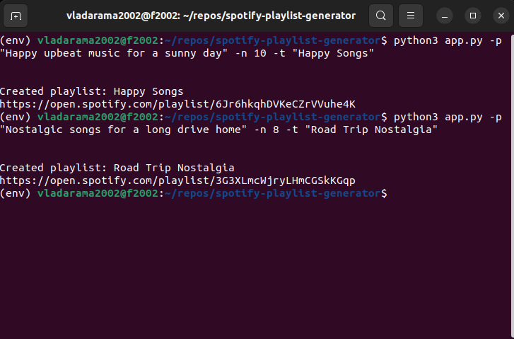
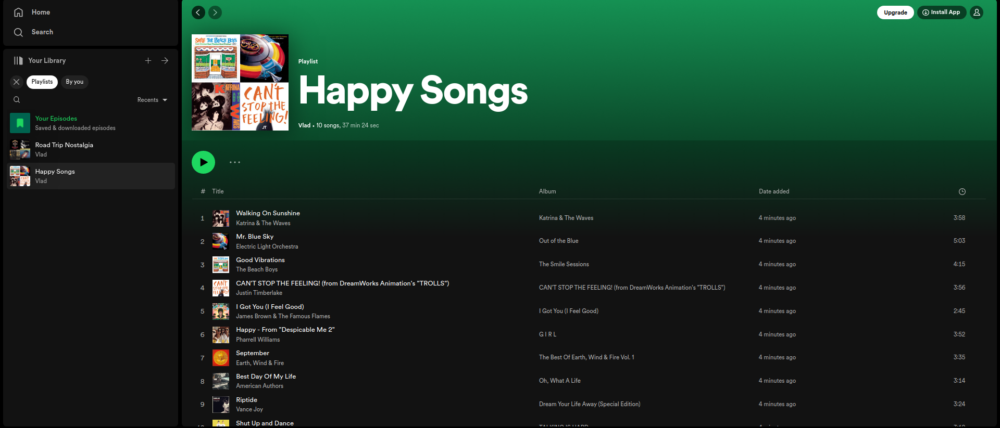
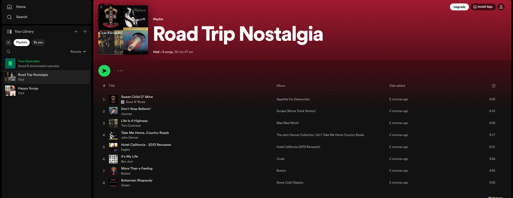

# Spotify Playlist Generator

Spotify Playlist Generator is a project that uses OpenAI's GPT-4 model to create a Spotify playlist based on a user's prompt. This app generates a list of songs and their artists that match the user's input, and then creates a Spotify playlist directly into the user's account.

## Table of Contents
- [Features](#features)
- [Technologies](#technologies)
- [What I Learned](#what-i-learned)
- [Setup and Installation](#setup-and-installation)
- [Usage](#usage)

## Features
* Generate a Spotify playlist based on user input
* Utilize GPT-3.5-Turbo or GPT-4 model to create a list of songs and artists
* Create a playlist into user's account using the Spotipy library

## Technologies
* Python
* OpenAI's Chat API
* GPT-3.5-Turbo / GPT-4
* Spotipy (Spotify Web API)

## What I Learned
During the development of this project, I gained valuable experience and insights into the following topics:
* Working with the OpenAI Chat API and understanding the capabilities of GPT-3.5-Turbo and GPT-4
* Exploring the potential of using AI for creative tasks, such as generating music playlists based on a simple user prompt
* Interacting with the Spotify Web API through the Spotipy library to create and manage playlists programmatically
* Developing a command-line interface for a Python application

## Setup and Installation

Your OpenAI Api Key can be created here: https://platform.openai.com/overview.

Your Spotify Client ID and Secret can be created here: https://developer.spotify.com/documentation/web-api

1. Clone the repository:
*git clone https://github.com/vladarama/spotify-playlist-generator.git*

2. Navigate to the project folder and create a virtual environment:
*cd spotify-playlist-generator*
*python -m venv venv*

3. Activate the virtual environment:
*source env/bin/activate*

4. Install the required dependencies:
*pip install -r requirements.txt*

5. Create a `.env` file in the root directory and add your OpenAI API key, Spotify Client ID, and Spotify Client Secret:
*OPEN_API_KEY=your_openai_api_key_here*
*SPOTIFY_CLIENT_ID=your_spotify_client_id_here* 
*SPOTIFY_CLIENT_SECRET=your_spotify_client_secret_here*

6. Run the app:
*python app.py*

## Usage
1. Run the app with the desired arguments:
Replace `Your Prompt` with the prompt describing the playlist, `8` with the number of songs you want in the playlist, and `Playlist Title` with the desired title of the Spotify playlist.

2. A new playlist will be created on your Spotify account which will contain songs of the specified theme.

3. The link to the newly created playlist will be displayed in the terminal.
